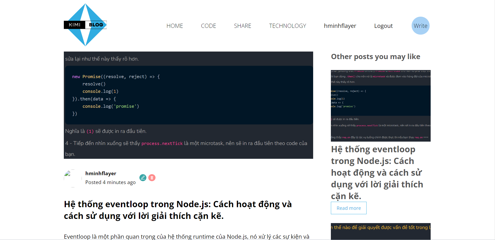

<h2 align="center">
  Kimi Pet Website - v1.0 
  <i>This is my blog</i>
</h2>
### Demo

  

  

  

 

## Built With

My blog which features some of my github projects as well as my resume and technical skills. 

This project was built using these technologies.

- React.js
- Node.js
- Express.js
- SCSS
- VSCode
- MySQL

## Features

**📖 Multi-Page Layout**

**🎨 Styled with Scss with easy to customize colors**

## Getting Started

Clone down this repository. You will need `Node.js` `MySql` and `Git` installed globally on your machine.

## 🛠 Installation and Setup Instructions
1. Run: `cd ./api`

2. Installation: `npm install`

3. In the project directory, you can run: `npm start` start server API

4. Run: `cd ..`

5. Run: `cd ./client`

6. Installation: `npm install`

7. In the project directory, you can run: `npm start` start Frontend for client

Runs the app in the development mode.\
Open [http://localhost:3000](http://localhost:3000) to view it in the browser.
The page will reload if you make edits.

## Usage Instructions

Open the project folder and Navigate to `/src/components/`.  
You will find all the components used and you can edit your information accordingly.

### Show your support

Give a ⭐ if you like this website!

#### Reference: Lamba Dev
